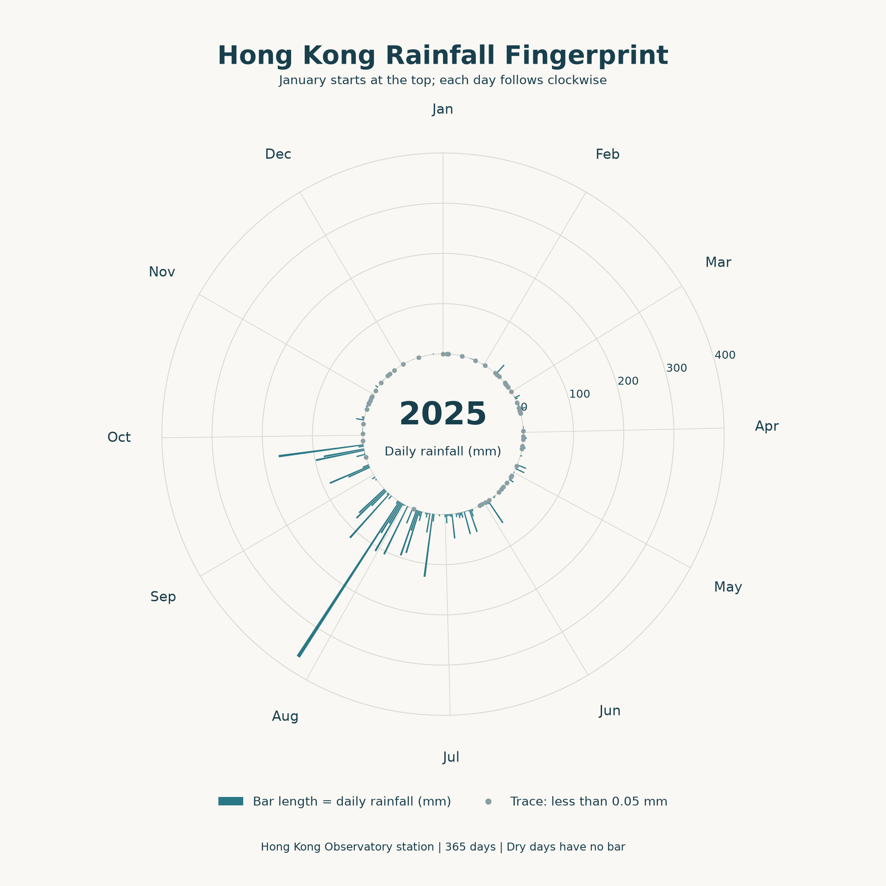

I chose Hong Kong rainfall for this project. Days run clockwise from January at
the top. I enlarged the line lengths to make small amounts easier to see.
Lines above 90 mm bend clockwise along the outer edge. The straight and curved
sections together stay proportional to rainfall.

The [data](https://data.weather.gov.hk/weatherAPI/cis/csvfile/HKO/ALL/daily_HKO_RF_ALL.csv)
comes from the Hong Kong Observatory station. Each row gives a date, daily
rainfall in millimetres, and a completeness flag. The saved file has 49,492
records; this plot uses the 365 days in 2025. The raw file is unchanged. This is
one station, not a city-wide average.


There are 53 `Trace` days, with less than 0.05 mm of rain. Grey ticks inside the
circle mark these days. Dry days have no line.




Most long paths start between July and September. The orange path is 5 August:
368.9 mm. Daily totals hide when the rain fell within each day.

```bash
uv run plot.py
```

**Submission note:** I forgot to submit this assignment on time.
